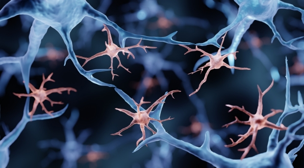

Dysfunction in microglia. Photo taken from Stanford Med

_Adapted from: https://med.stanford.edu/news/all-news/2023/09/stem-cell-alzheimers.html

In the ever-evolving landscape of medical research, a revolutionary breakthrough is offering new hope in the fight against Alzheimer’s disease.

Affecting millions of people globally, Alzheimer’s is a devastating neurodegenerative disorder characterized by memory loss, cognitive decline, and personality changes. According to the Centers for Disease Control and Prevention (CDC), “the number of people living with the diseases doubles every 5 years beyond age 65 which predicts the [total number of patients to 14 million](https://med.stanford.edu/news/all-news/2023/09/stem-cell-alzheimers.html) by 2060”.

Current intervention methods only include helping people maintain brain health, managing behavioral symptoms, or delaying symptoms of the disease. So how are Stanford Medicine researchers finding success in fighting this disease?

Researchers believe a novel approach involving blood stem cell transplants is the answer. Blood stem cells, also known as hematopoietic stem cells, are responsible for producing all the different types of blood cells in the body. 

 ### Promise of Blood Stem Cells

Researchers at Stanford Medicine, led by Marius Wernig, MD, PhD, have initiated a groundbreaking study published in Cell Stem Cell. Their work centers around a remarkable concept: replacing defective neural cells in mice with Alzheimer’s through blood stem cell transplants. This technique targets microglia, the brain’s innate immune cells crucial for maintaining neural health.

### Microglia and Alzheimer’s

But wait – what are microglia, and why are they so important? Microglia act as the brain’s janitors, clearing out metabolic waste and defending against invaders. In Alzheimer’s disease, these cells can become dysfunctional, exacerbating the buildup of amyloid plaques – a hallmark of the disease. Wernig’s team focused in on a specific gene, TREM2, known for its critical role in microglial function. Mutations in TREM2 are strongly linked to increased Alzheimer’s risk, highlighting its pivotal role in disease progression.

### The Breakthrough Study: Lab Mice

In their study, mice with defective TREM2 genes received transplants of hematopoietic stem and progenitor cells from healthy mice. These transplanted cells not only reconstituted the blood system, but also integrated into the brain as functional microglia, effectively replacing the diseased cells. Hematopoietic stem and progenitor cells are crucial for generating all blood cell types, including red blood cells, white blood cells and platelets. The results? Amyloid plaques decreased, microglial function improved, and disease markers diminished – all from restoring the function of a single gene.

### Engineering Cells with Enhanced TREM2 Activity

Dr. Wernig and his team didn’t stop there. They explored the potential of engineering cells with enhanced TREM2 activity, envisioning an even more therapeutic effect. The new microglia, though effective, differed slightly from natural ones, prompting further research to ensure unintended consequences are mitigated before human trials.

### Challenges and Future Directions

For human trials, current procedures involve toxic chemotherapy or radiation to prepare patients for stem cell transplants, limiting widespread use. Yet, hope persists as researchers worldwide strive for safer, less invasive methods to facilitate such therapies.

### Looking Ahead

As we look to the future, while the journey from mice to humans is steep, the breakthroughs made by Dr. Wernig and his team offer hope for millions affected by this disease. One day, perhaps sooner than we think, Alzheimer’s treatment could be revolutionized – not by pills, but by synthetic biology and therapeutics.
