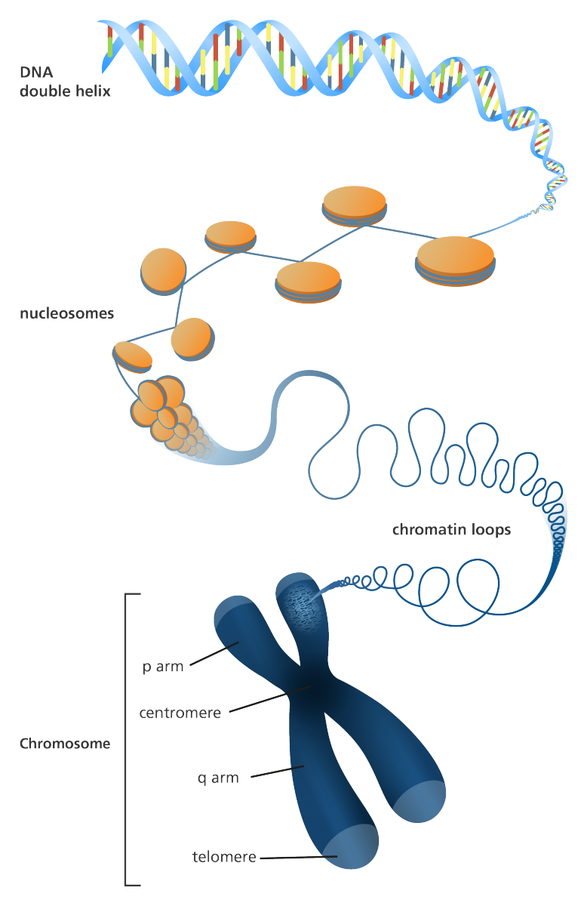

Adapted from: [DNA storage—from natural biology to synthetic biology](https://www.csbj.org/article/S2001-0370(23)00045-4/fulltext)

## We Have a Lot of Data

We’ve all seen the warning that our Google Drive is reaching max capacity, and most of us delete a few documents, and move on with our lives. Everyone may store 10-15 GB of data on Google’s Cloud servers, and in addition to the massive scale of data that companies and universities collect, this quickly adds up. In fact, [**the average enterprise has 347.56TB** of data](https://cdn2.hubspot.net/hubfs/1624046/IDGE_Data_Analysis_2016_final.pdf). Furthermore, the amount of data we have [stored in the cloud](https://www.globaldots.com/resources/blog/how-much-is-stored-in-the-cloud) is around 1 exabyte of data, or 1024 Petabytes of data, and this excludes other forms of storage such as cold storage. It’s not a bad thing to store lots and lots of information, in fact, storing copies of data is a good practice for preserving important information. The problem is that storing all this data has consequences on the planet, such as using up to [2% of our global energy usage, and nearly 200 acres of land apiece](https://medium.com/stanford-magazine/carbon-and-the-cloud-d6f481b79dfe).

Computer scientists and engineers have tried to look for ways to make storage systems more compact and efficient, but are currently limited by the [laws of physics](https://spectrum.ieee.org/the-tunneling-transistor). This points to us needing to look else where for inspiration; one place to look is in fact, at the building blocks of nature: DNA. DNA is a [“complex molecule that contains all of the information necessary to build and maintain an organism”](https://www.nature.com/scitable/topicpage/introduction-what-is-dna-6579978/). One thing that DNA excels at is being highly compact and dense, in fact, we can store all of the [world’s information in a cup of DNA](https://news.mit.edu/2021/dna-data-storage-0610); engineers are no where near this level of compactness with current systems of storing data. 

## Types of Storage

Before we start talking about DNA, we must highlight the different types of storage. Very generally, we have short term and long term storage. Short term storage allows for fast read and write access, at the expense of the data on the storage medium having a short lifetime. On the other hand, long term storage takes a long time to read and write data, with the advantage of very stable mediums for storing data for very long times. We currently store long term information in big data centres or cold storage forms such as on paper, which makes maintaining buildings to store this data and transporting these types of data a difficult task.

When DNA is properly prepared and stored, it has a very stable shelf life. However, synthesizing and sequencing DNA with current technologies is very slow, making it a form of long term storage. As of now, working with DNA ex vivo is not the easist task.

The good news is that our bodies have mastered the transportation and storage of DNA, partially due to the multiple levels of abstraction of DNA! First off, what is an abstraction? [Abstraction](https://www.nature.com/scitable/blog/bio2.0/abstraction/) is an “engineering principle that allows us to ignore unnecessary details and focus only on a particular level of organization”. In synthetic biology, the first level of abstraction may be the DNA sequence made up of nucleotides. However, we may reuse certain sequences of DNA over and over, such as the DNA sequence for the GFP gene, which is a gene that glows green. Thus, we want to refer to that DNA sequence as a gene, which makes a gene the second level of abstraction. A gene is a type of data abstraction, whereas we will be talking about the *physical abstractions* of DNA, which allow for DNA to be very compact.

## The Physical Abstractions of DNA

What we commonly refer to as DNA, actually has many [levels of physical abstraction](https://www.csbj.org/article/S2001-0370(23)00045-4/fulltext), from chromosomes, to nucleosomes, and finally the DNA itself. But how compact are these DNA abstractions? 

Very compact, in fact, Professor Yingjin Yuan states in an [article](https://www.nature.com/articles/d42473-022-00319-3#:~:text=The%20largest%20human%20chromosome%20carries,microorganism%2C%20typically%20has%2016%20chromosomes), that

> “DNA has evolved to store massive quantities of information at very high density, and it’s remarkably stable, too. The largest human chromosome carries up to 250 million base pairs of DNA. If data could be stored on every base pair, all the data in the world could theoretically fit in a coffee mug,” says Yuan.
> 

## Chromosomes

The highest level of abstraction of DNA is a chromosome. A [chromosome](https://en.wikipedia.org/wiki/Chromosome) is a package of DNA tightly coiled around proteins. Our bodies effortlessly move chromosomes throughout our body in order to direct the production of required proteins, as chromosomes are important for cellular division. Thus, the goal of a chromosome is to transport genetic materal from one generation to another. Chromosomes can contain any number of base pairs; in humans this ranges from around 50 million to 250 million base pairs. A chromosome of 250 base pairs contains around 59 MB and the human genome contains around 800 MB. Chromosomes also have unique 3D structures, which could provide the potential for humans to discover more complex ways of describing information such as files, books, or more using the same DNA sequence! Currently, we must rely on standards such as ASCII and Unicode to help us interpret a sequence of bits; if the 3D structure of a chromosome could directly tell us how to interpret a sequence of information this could open up ways of describing information in more unique ways.

## Nucleosomes

The second highest level of abstraction are nucleosomes, which are individual proteins that have a DNA wrapper around them; a chromosome is a multiple of many nucleosomes. When DNA forms a [complex with chromatin](https://www.nature.com/scitable/definition/nucleosome-nucleosomes-30/#:~:text=A%20nucleosome%20is%20a%20section,resembles%20beads%20on%20a%20string), it is referred to as a nucleosome, condensing it into smaller volume. Thus, nucleosomes help us keep DNA nicely folded and packed away.

## DNA

And finally, the lowest level of abstraction is the DNA itself, which comprises of the four nucleotides, adenine (A), thymine (T), guanine (G), and cytosine (C). Our team will be encoding, storing and decoding data at this level of abstraction.

## What’s next?

While our bodies have perfected the storage and transportation of long term data with DNA, we are yet to know how this exactly works. As of now, figuring out how these strategies work at the chemical and biological level are active areas of research, and how these mechanisms can be exploited for our use is another area of research we must tackle before we can use utilize structures like chromosomes or nucleosomes for storing our own types of data.

